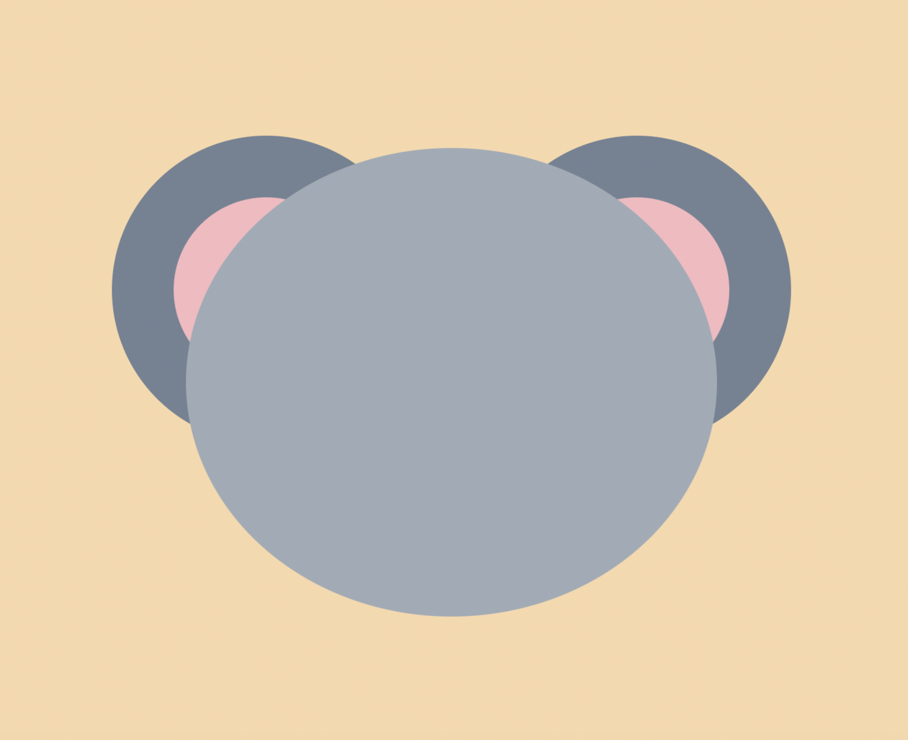
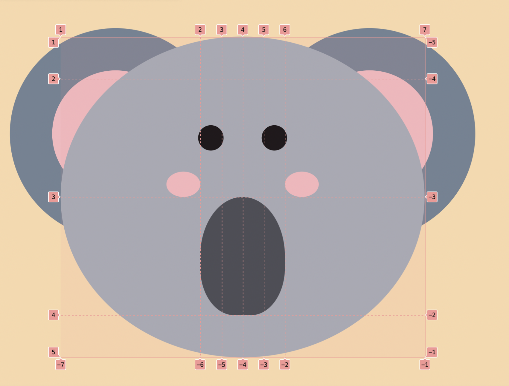
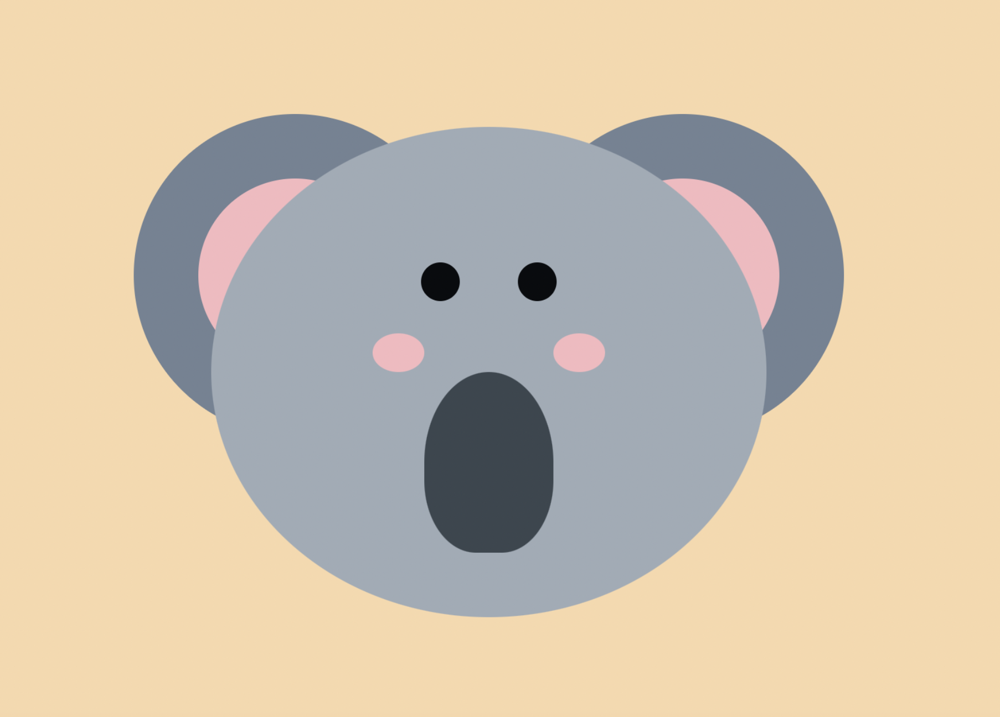

# Draw a Koala

To get started, open the editor on the right. You should see two files — `index.html` and `styles.css` from your editor. You can see it as follows:

## Requirements

- Please click "Go Live" in the bottom right corner to open port 8080.
- Please complete this challenge in the `styles.css` file.
- Create a grid layout with 6 columns: front and back in two equal parts (you can use fr to represent one), with the middle 4 columns all `25px` wide; 4 rows: top and bottom `50px`, with the middle in two equal parts. 2.
- drawing eyes: `30px` long, `30px` high, `#090b0e` colour, `50%` rounded corners, centred. 3. drawing of nose: `30px` high, `30px` high, `#090b0e` colour, `50%` rounded corners, centred.
- Draw the nose: `100%` high, `#3b464f` colour, `50%` rounded corners top and `40%` rounded corners bottom, select `grid-area` as shown.

## Example

For the position of the parts of the koala's face, refer to the following grid drawing:

The finished result is as follows:

