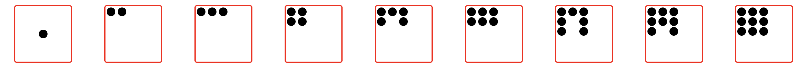
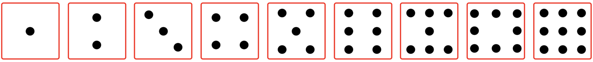
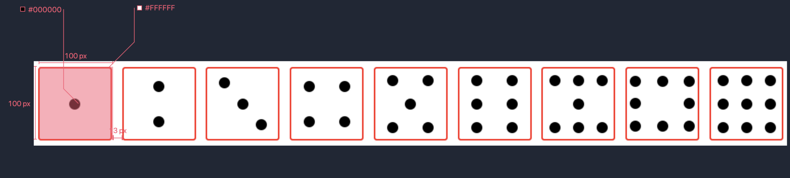

# Flex Dice Layout

To get started, open the editor on the right. You should see a file — `index.html` from your editor. You can see it as follows:

## Requirements

- Please click "Go Live" in the bottom right corner to open port 8080.
- Please complete this challenge in the `index.html` file.
- dice 1: use `justify-content` and `align-items` attributes to achieve this. 3. dice 2: use `justify-content` and `align-items` attributes to achieve this.
- dice 2: implemented using the `justify-content`, `flex-direction` and `align-items` attributes. 4. dice 3: implemented using the `justify-content`, `flex-direction` and `align-items` attributes.
- dice 3: implemented using the `justify-content`, `align-self` and `align-items` attributes. 5.
- dice 4, 5, 6, 7, 9: similar layout structure: implemented using the `justify-content`, `align-self`, `flex-direction` and `align-items` attributes. 6. dice 8: implemented using the `justify-content`, `align-self` and `align-items` attributes.
- dice 8: implemented using the `justify-content`, `flex-wrap`, `flex-basis` and `align-items` attributes.

## Example

Layout the page according to the properties required in the test requirements, without over-sample settings. Do the following (overall page width `1024px`) as required above:

The key dimensions are annotated as follows: (you can view the key dimensions by right-clicking on the image" Open image in a new tab, or right-clicking " copy the image address and open it in a new browser tab and zoom in on the image)

