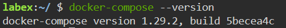

# Install Docker Compose

## Introduction

Docker Compose is a tool for defining and running multi-container Docker applications. To deploy Jenkins with Docker, you need to install Docker Compose.

## Target

To install Docker Compose.

## Result Example 

Docker Compose installed successfully.

