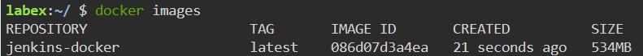

# Build a Docker Image for Jenkins

## Introduction

After installing Docker Compose, you can start building a Docker image for Jenkins.

## Target

To build a Docker image for Jenkins.

## Result Example

1. Create a file named "Dockerfile" with the following contents:

- Base image from jenkins/jenkins:lts
- Install required plugins
- Expose `8080` and `50000` ports
- Set Jenkins environment variables

2. To build a Docker image called `jenkins-docker` for Jenkins.This step will take a few minutes, please be patient.

