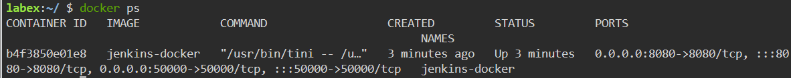
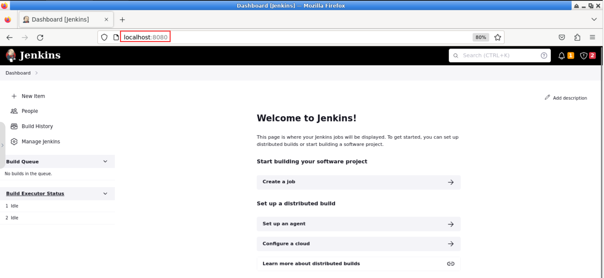

# Run Jenkins in a Docker Container using Docker Compose

## Introduction

After building the Docker image for Jenkins, you can now run Jenkins in a Docker container using Docker Compose.

## Target

To run Jenkins in a Docker container using Docker Compose.

## Result Example

1. Create a file named `docker-compose.yml` that defines a service named `jenkins`. This service is based on an image called `jenkins-docker`. The service mounts a volume named `jenkins-data` and maps it to the `/var/jenkins_home` directory. Additionally, it exposes ports `8080` and `50000` for communication. Finally, the service is confined to the `jenkins` network.

2. Run Jenkins in a Docker Container using Docker Compose.

3. Open a web browser and go to `http://localhost:8080` to access the Jenkins web interface.

