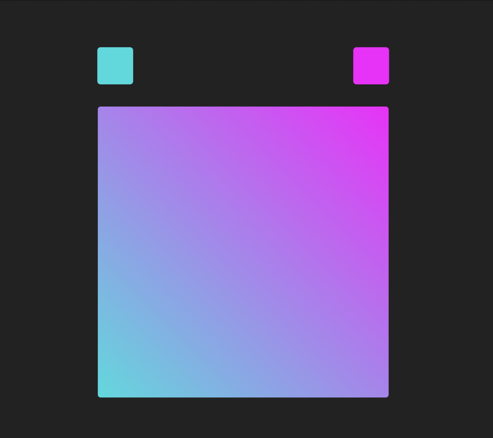
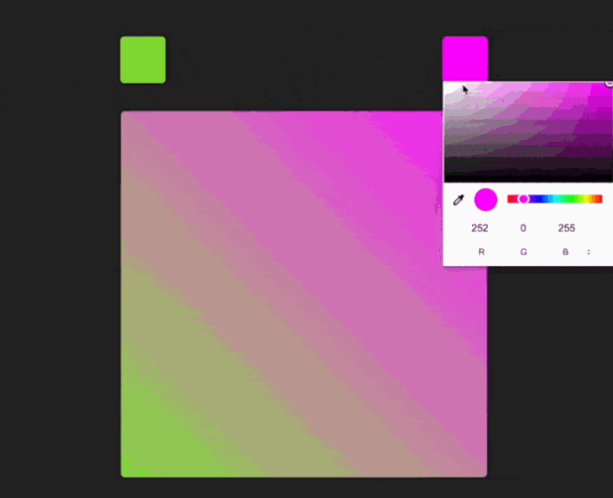

## Gradient Background Generator

To get started, open the editor on the right. You should see three files — `index.html`、`styles.css` and `index.js` from your editor. You can see it as follows:

The current colour block and gradient background are initial values and will not be updated automatically.

## Requirements

- Please click "Go Live" in the bottom right corner to open port 8080.
- Please complete this challenge in the `index.js` file.
- Please add the appropriate JS event handler and bind it to the appropriate event listener (hint: `change` event).

## Example

The finished result is as follows:

## Reference

[Customizing Properties (Variables) with CSS - MDN Documentation](https://developer.mozilla.org/en-US/docs/Web/CSS/Using_CSS_custom_properties)
