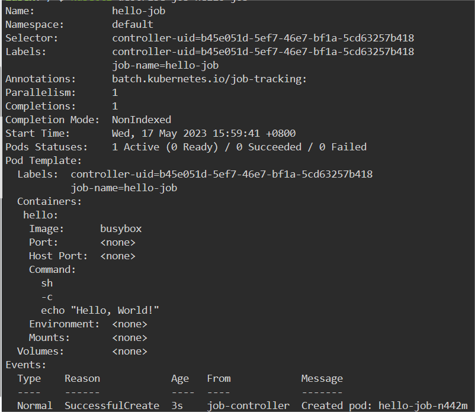
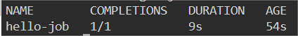

# Run a Pod with a Job

## Introduction

In this step, we will learn how to create a pod that runs a command to print `Hello, World!` to the console.

## Target

Your goal is to define a job named `hello-job` that runs a single container named `hello`. The container runs the `busybox` image and executes a command to print `Hello, World!` to the console.

## Result Example

Here is an example of what you should be able to accomplish at the end of this step:

1. Create a file named `job.yaml`, The content of the YAML is created as follows:

- The name of the job called `hello-job`.
- The deployment's image is `busybox:latest`.
- The command is `echo "Hello, World!"`.

2. Use `kubectl apply` command to deploy the YAML file.

3. Check the status of the job.

4. View the logs of the pod.

