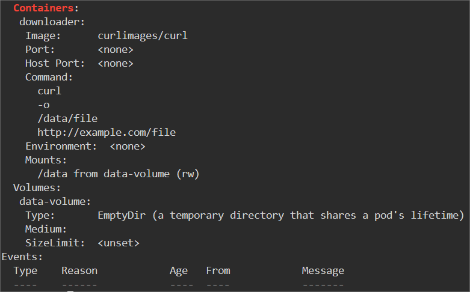
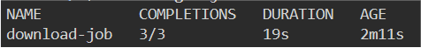
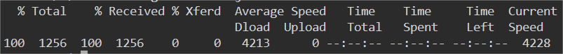

# Run a Job with Multiple Pods

## Introduction

In some cases, you may need to run a job with multiple pods for better performance. In this step, we will create a job that runs multiple pods to download files from a remote server.

## Target

Your goal is to define a job named `download-job` that runs multiple pods with the `curlimages/curl` image. Each pod downloads a file from `http://example.com/file` and saves it to a shared volume named `data-volume`.

## Result Example

Here is an example of what you should be able to accomplish at the end of this step:

1. Create a file named `multi-pod-job.yaml`, The content of the YAML is created as follows:

- The name of the job called `download-job`.
- The deployment's image is `curlimages/curl`.
- The command is `curl -o /data/file http://example.com/file`.
- Mount to the `/data` directory in the container using a volume with mode `emptyDir`.

2. Use `kubectl apply` command to deploy the YAML file.

3. Check the status of the job.

4. View the logs of the pod.

