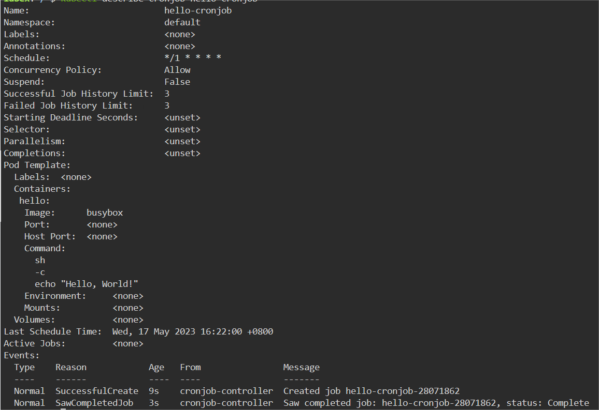
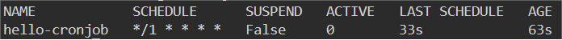
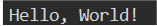

# Run a CronJob

## Introduction

In addition to one-off jobs, Kubernetes also supports cronjobs for running tasks on a regular schedule. In this step, we will learn how to create a cronjob in kubernetes.

## Target

Your goal is to create a cronjob called `hello-cronjob` that runs the `echo "Hello, World!"` command every minute.

## Result Example

Here is an example of what you should be able to accomplish at the end of this step:

1. Create a file named `cronjob.yaml`, The content of the YAML is created as follows:

- The name of the job called `hello-cronjob`.
- The deployment's image is `busybox:latest`.
- The command is `echo "Hello, World!"`.
- The cronjob runs every `1` minutes.

2. Use `kubectl apply` command to deploy the YAML file.

3. Check the status of the cronjob.

4. View the logs of the cronjob's pod.

