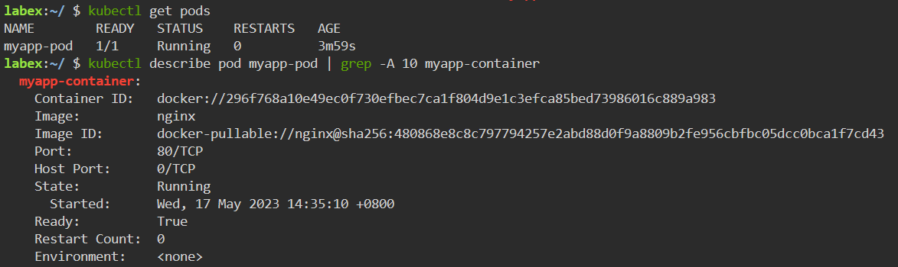

# Create a Pod

## Introduction

In this step, we will create a pod in kubernetes.

## Target

Your goal is to create a pod called `myapp-pod` in the kubernetes.

## Result Example

Here is an example of what you should be able to accomplish at the end of this step:

1. Create a file named `myapp-pod.yaml`, The content of the YAML is created as follows:

- The name of the pod called `myapp-pod`.
- The deployment's image is `nginx:latest`.
- Declare port `80` of the container.

2. Use `kubectl apply` command to deploy the YAML file.

