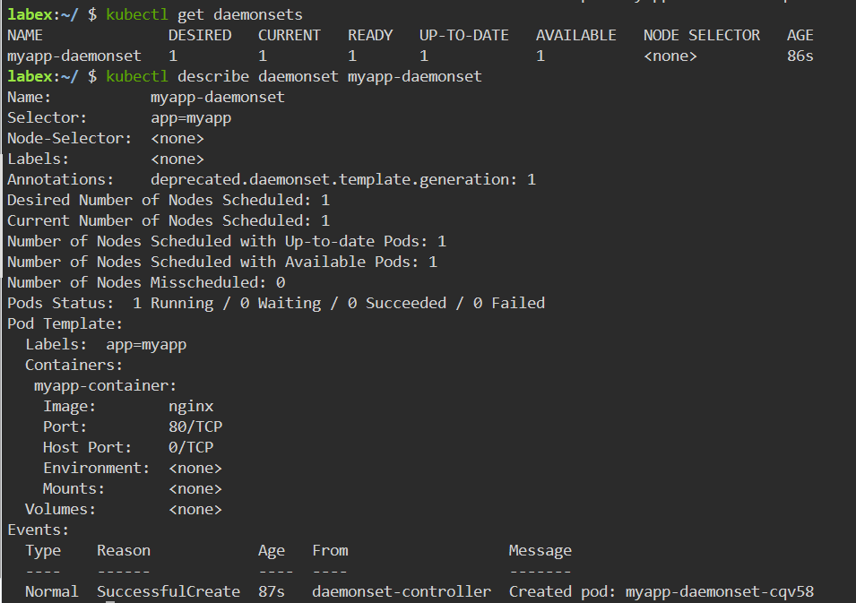

# Create a DaemonSet

## Introduction

In this step, we will learn how to create a daemonset in kubernetes.

## Target

Your goal is to create a daemonset named `myapp-daemonset` in the kubernetes. The daemonset will run the `nginx` image and will run only one instance. The image will be run on each node in the cluster.

## Result Example

Here is an example of what you should be able to accomplish at the end of this step:

1. Create a file named `myapp-daemonset.yaml`, The content of the YAML is created as follows:

- The name of the daemonset called `myapp-daemonset`.
- The deployment's image is `nginx:latest`.
- Declare port `80` of the container.

2. Use `kubectl apply` command to deploy the YAML file.

