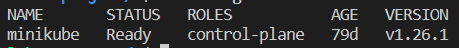
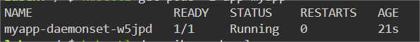

# Verify the DaemonSet

## Introduction

Verifying a DaemonSet in Kubernetes involves ensuring that the desired number of pods are running on the target nodes, and that the pods are healthy and functioning as expected. In this step, we will learn how to verify the daemonset has been created.

## Target

Your goal is to verify that the daemonset has been successfully created.

## Result Example

Here is an example of what you should be able to accomplish at the end of this step:

1. Use `kubectl get` command to list the nodes in the cluster.

2. Use `kubectl get` command to list the pods created by daemonset.

