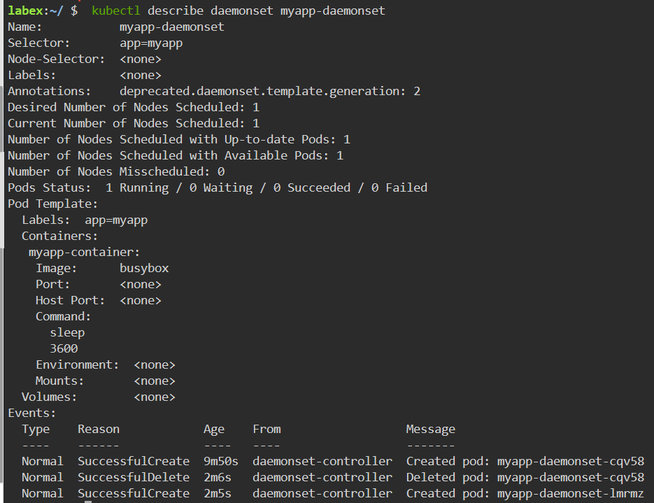

# Update the DaemonSet

## Introduction

Updating a DaemonSet in Kubernetes involves modifying the DaemonSet specification to reflect the desired changes, and then rolling out the changes to the cluster. There are several different strategies that can be used to update a DaemonSet, depending on the specific requirements of the application. In this step, we will update the image of the daemonset.

## Target

Your goal is to modify the image of the DaemonSet called `myapp-daemonset` to `busybox:latest` and add the `sleep 3600` start command to it.

## Result Example

Here is an example of what you should be able to accomplish at the end of this step:

1. Create a file named `myapp-daemonset-update.yaml`, The content of the YAML is created as follows:

- The name of the daemonset called `myapp-daemonset`.
- Update the deployment's image is `busybox:latest`.
- The command is `sleep 3600`.

2. Use `kubectl apply` command to deploy the YAML file.

