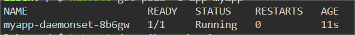

# Verify the Update

## Introduction

In this step, we will learn how to check that the Daemonset changes are in effect.

## Target

Your goal is to check that the image modified by the Daemonset named `myapp-daemonset` is `busybox:latest`.

## Result Example

Here is an example of what you should be able to accomplish at the end of this step:

Use `kubectl get` command to list the pods created by Daemonset.

