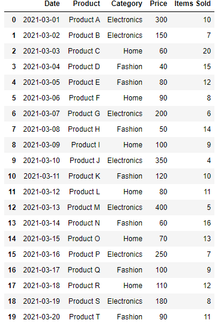

# Sub-challenge 1: Data Cleaning

**Introduction:**

    In this sub-challenge, your goal is to clean and preprocess the raw sales data. This step is crucial to ensure that the dataset is free of errors and inconsistencies, which could affect the accuracy of your analysis.

**TODO:**

    1. Load the dataset into a Pandas DataFrame. 
    2. Handle missing values: identify and deal with missing values in the dataset. 
    3. Handle duplicate records: identify and remove any duplicate records in the dataset. 
    4. Handle outliers: identify and deal with any outliers in the dataset. 
    5. Normalize the data: apply scaling techniques to standardize the range of the data. 

**Example:**

    This is an example of a DataFrame after cleaning the data:

