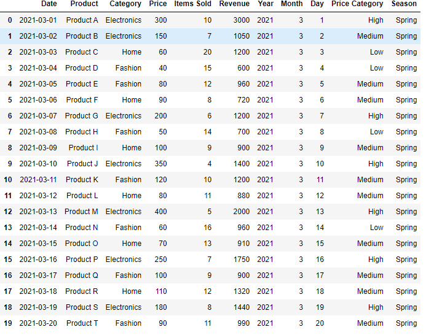

# Sub-challenge 2: Feature Engineering
**Introduction:**

    In this sub-challenge, you will create new features from the existing data to enhance your analysis. Feature engineering can help you uncover hidden patterns and relationships within the data, which can lead to more accurate predictions and insights.

**TODO:**

    1. Create a new feature 'Revenue' by multiplying 'Price' and 'Items Sold'. 
    2. Extract 'Year', 'Month', and 'Day' columns from the 'Date' column. 
    3. Create a new feature 'Price Category' based on the 'Price' column (e.g., low, medium, high). 
    4. Create a new feature 'Season' based on the 'Month' column. 

**Example:**

    This is a result example (challengers should do this sub-challenge on the result DataFrame of sub-challenge 1.):

