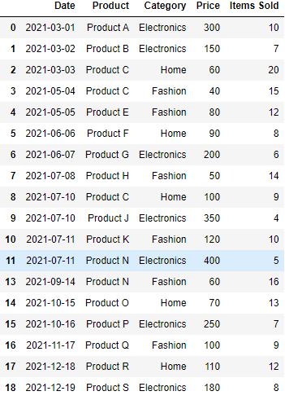
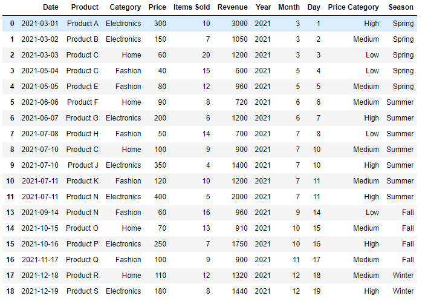

# Feature Engineering
In this sub-challenge, you will create new features from the existing data to enhance your analysis. Feature engineering can help you uncover hidden patterns and relationships within the data, which can lead to more accurate predictions and insights.

**TODO:**
1. Create a new feature 'Revenue' by multiplying 'Price' and 'Items Sold'.
2. Extract 'Year', 'Month', and 'Day' columns from the 'Date' column using the Pandas `pandas.dt`.
3. Create a new feature 'Price Category' based on the 'Price' column (e.g., low, medium, high) in the function `price_category`.
4. Create a new feature 'Season' based on the 'Month' column in the function `season`.

## example

The original DataFrame before processing looks like this (the result of Data Cleaning):

The DataFrame processing result is as follows:

