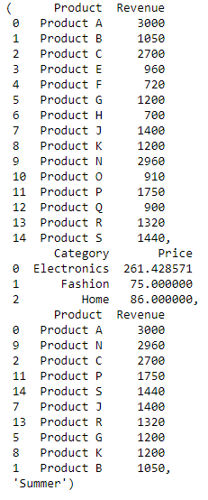

# Data Aggregation
In this sub-challenge, you will aggregate the data to answer specific questions or derive insights about the dataset. Data aggregation involves grouping and summarizing data to reveal patterns or trends.

**TODO:**
1.  Create the `aggregate_data` function in the `aggregate_data.py`.
2.  Calculate the total revenue for each product.
3.  Calculate the average price per category.
4.  Find the top 10 products with the highest revenue.
5.  Identify the season with the highest sales.


*returned values shoud be sequenced as `total_revenue_per_product`, `avg_price_per_category`, `top_10_products`, and `highest_sales_season`*

## Example

Challengers can run the data_aggregation.py file to verify the correctness of the code:
```
python3 data_aggregation.py
```
The data processing result is as follows:

