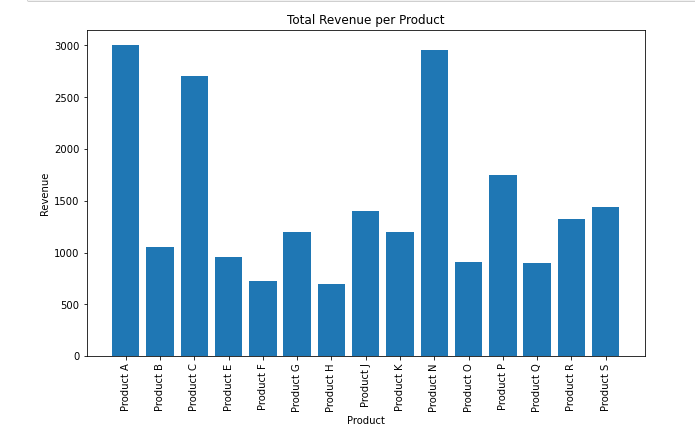
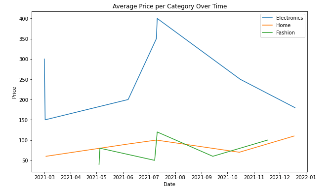
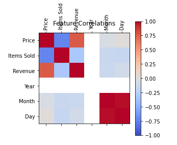
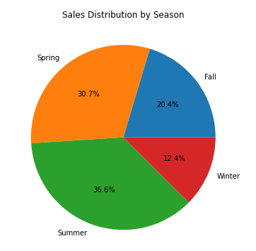

# Data Visualization
In this sub-challenge, you will create visualizations to help you better understand the dataset and communicate your findings. Effective visualizations can make complex data more accessible and easier to interpret.

**TODO:**
1. Create a bar chart to visualize the total revenue per product using the Matplotlib `matplotlib/bar`.
2. Create a line chart to visualize the average price per category over time using the Matplotlib `matplotlib/plot` and `matplotlib/legend`.
3. Create a heatmap to visualize the correlation between features using the Matplotlib `matplotlib/matshow` and `matplotlib/legend`.
4. Create a pie chart to visualize the distribution of sales by season using the Matplotlib `matplotlib/pie`.
5. Every chart should be applied xyLabel using the Matplotlib `matplotlib/xy_label` and title using the Matplotlib `matplotlib/title`

**Example:**
The created visualizations should be look like pictures below:

`Bar Chart:`

`Line Chart:`

`Heatmap:`

`Pie Chart:`

