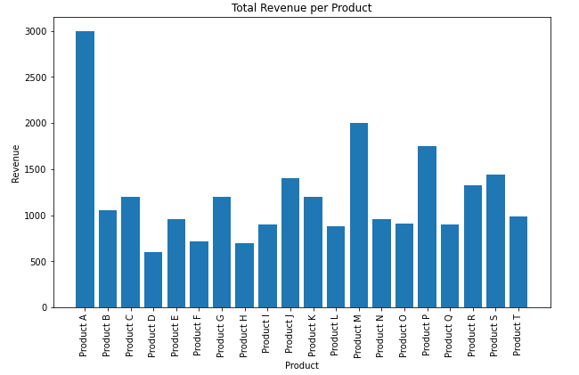
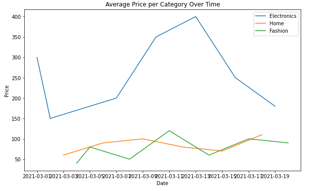
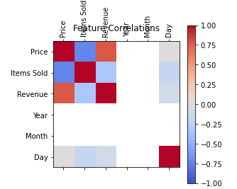
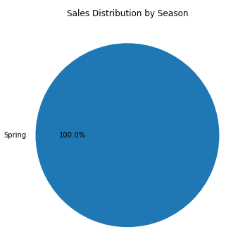

# Sub-challenge 4: Data Visualization
**Introduction:**

    In this sub-challenge, you will create visualizations to help you better understand the dataset and communicate your findings. Effective visualizations can make complex data more accessible and easier to interpret.

**TODO:**

    1. Create a bar chart to visualize the total revenue per product. 
    2. Create a line chart to visualize the average price per category over time. 
    3. Create a heatmap to visualize the correlation between features. 
    4. Create a pie chart to visualize the distribution of sales by season. 

**Example**

    The created visualizations should be look like pictures below:

`#0969DA` Bar Chart

`#0969DA` Line Chart

`#0969DA` Heatmap

`#0969DA` Pie Chart

