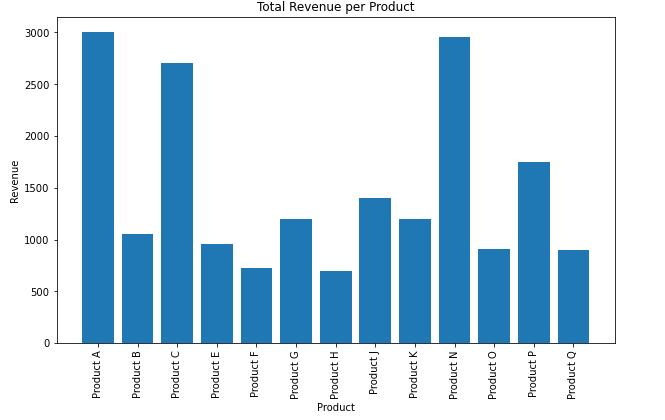

# Data Visualization

In this sub-challenge, you will create visualizations to help you better understand the dataset and communicate your findings. Effective visualizations can make complex data more accessible and easier to interpret.

**TODO:**

1.  Create the `visualize_data` function in the `visualize_data.py`.
2.  Create a `bar chart` to visualize the total revenue per product.
3.  Create a `line chart` to visualize the average price per category over time.
4.  Create a `heatmap` to visualize the correlation between features.
5.  Create a `pie chart` to visualize the distribution of sales by season.
6.  Every chart should be applied `xyLabel` and `title`.
7.  Demonstrate each chart using `matplotlib.show`.

**Example:**

Challengers can run the data_visualization.py file by clicking 'Run Cell' at the top of the code to verify the correctness of the code:

The created visualizations should be look like pictures below:

`Bar Chart:`

`Line Chart:`

`Heatmap:`

`Pie Chart:`

